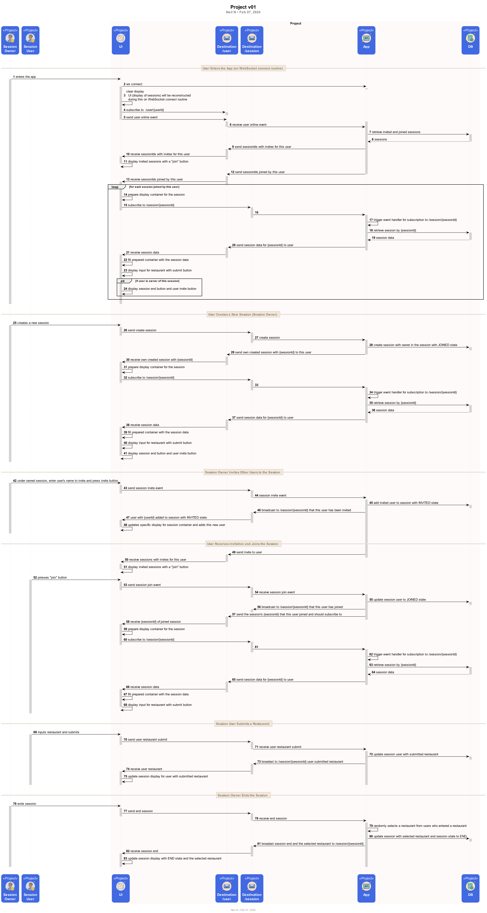

# Group Restaurant Picker

- [Group Restaurant Picker](#group-restaurant-picker)
  - [Design](#design)
  - [API](#api)
  - [Database](#database)
- [Deployment](#deployment)
  - [Installation Requirements](#installation-requirements)
  - [Configuration](#configuration)
  - [Local Deployment](#local-deployment)

## Design

This project leverages on STOMP over WebSocket messaging with Spring to create an interactive web app for selecting a restaurant from the choices submitted by a group of users (a session).

It uses the direct messaging on `/user` to deliver full session information to the UI when a user first enters the app or joins a session.  Then uses broadcast messaging over `/session` to deliver the deltas or specific session data changes to users subscribed to that session.

Session information and its users are persisted into a PostgreSQL database.  

In the above diagram, under the first section "User Enters the App (on WebSocket connect routine)", it shows how the UI is initially constructed from the full session information delivered through `/user` as soon as the the user enters the app.

In later sections, like "Session Owner Invites Other Users to the Session" and "User Receives Invitation and Joins the Session", shows how the UI receives broadcast messages from `/session` about specific changes in the session so that it can make specific UI element updates in real time.

Used:
 - STOMP
 - Spring Boot 
 - PostgreSQL
 - Flyway
 - Javascript
 - HTML
 - CSS

## API

Description of the APIs used are in the [API doc](docs/api.md)

## Database

Description of the DB schema are in the [Database doc](docs/database.md)

# Deployment

## Installation Requirements
  - PostgreSQL with empty `eatwhere` database created
  - Flyway will create the schema using the migration scripts located under [src/main/resources/db/migration/](src/main/resources/db/migration/) when the app is started

## Configuration

Properties that need to be configured in [application.properties](src/main/resources/application.properties)

| Property | Type | Description |
| --- | --- | --- |
| `spring.datasource.url`   *required* | string | URL to PostgreSQL `eatwhere` DB | 
| `spring.datasource.username`   *required* | string | DB user |
| `spring.datasource.password`   *required* | string | DB password |

## Local Deployment

Start the application by running:  
`./mvnw install`  
`./mvnw spring-boot:run`

The application runs in port `8080` and web app can be accessed in [http://localhost:8080/](http://localhost:8080/)
